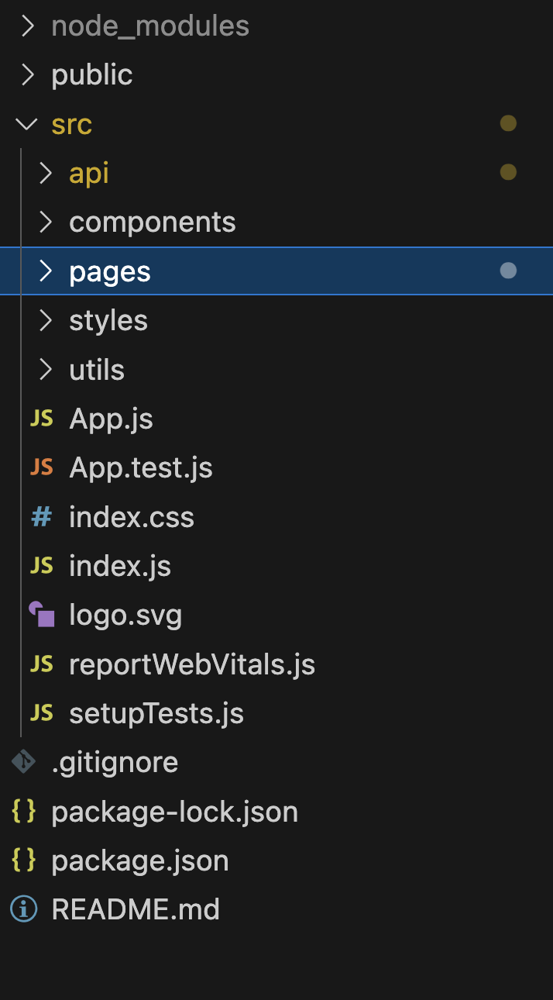
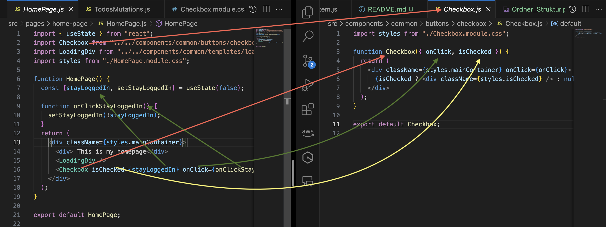
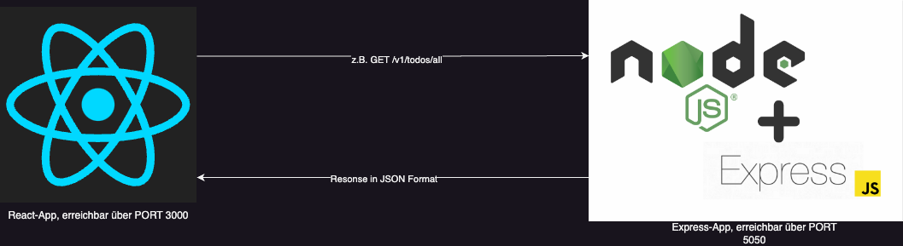
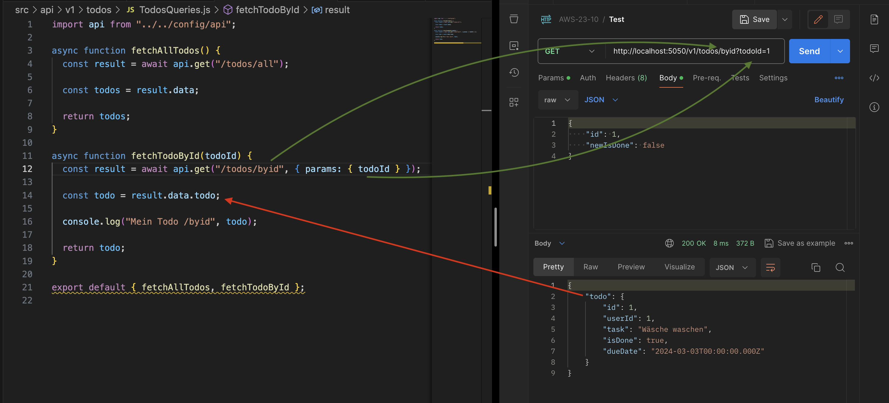
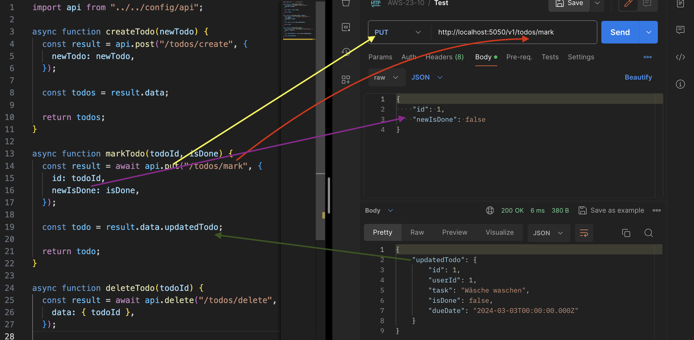
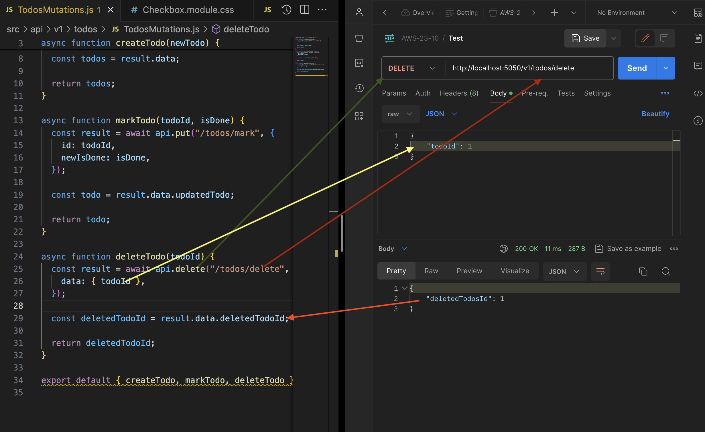

# React Dokumentation

React ist ein Framework, welches bei der Entwicklung komplexer Webseiten helfen kann.
Dabei wird versucht die Webanwendung in verschiedene Komponenten aufzuteilen, um die Logik einzelner Komponenten aufzubrechen.
Die Vorteile die daraus entstehen:

- Wiederverwendbarkeit einzelner Komponenten
- Der Code wird langfristig deutlich übersichtlicher
- Einfache Integration von npm Paketen

## Grundlegende Ordner Struktur



### public Ordner

Der public Ordner enthält statische assets, wie Bilder und die favicon.ico Datei.
Außerdem enthält er die `index.html`, welche als Einstiegspunkt für unsere React App dient nd ein Skript lädt, um die React App zu starten. Zu diesem Zeitpunkt soll uns diese Datei aber erstmal nicht interessieren.

### Weitere Dateien, die ihr schon aus anderen Node Projekten kennt

- `package.json`: Enthält Pakete und die hinterlegten Skript: `npm run start`, um React App zu starten
- `package-lock.json`: Hinterlegt installierte Pakete und deren Versionen
- `.gitignore`
- `node_mmodules`

### src

- Der `./src` Ordner enthält die eigentliche React App

### ./src/index.js

Die `.src/index.js` ist das Einstiegsskript, welches von der zuvor angesprochenen `index.html` geladen wird

```javascript
import React from "react";
import ReactDOM from "react-dom/client";
import "./index.css";
import App from "./App"; // <-- Import von unserer ./src/App.js

const root = ReactDOM.createRoot(document.getElementById("root"));
root.render(
  <React.StrictMode>
    <App /> {/* Integration der App */}
  </React.StrictMode>
);
```

### ./src/App.js

- Laden von styles, die global in der App verfügbar sind

```javascript
import "./styles/App.css";
import "./styles/GlobalVars.css";
```

- Grundlegendes Layout
  --> Unterteilung in NavBar, Content, Footer
- Integration von Routing (dazu mehr später)

### /src/api

In diesem Ordner sollen sich alle API Anfragen an unsere Express App befinden
(dazu unten mehr)

### /src/compoents

- Hier sollen alle wiederverndbaren und integrierten einzelnen Komponenten abgelegt werden

### /src/pages

- Hier sollen alle Seiten abgelegt werden
  --> z.B für die Route /impressum die Seite Impressum Page als React Komponente

### /src/styles

Hier sollen sich alle global definierten styles befinden
Diese sollten dann in der zuvor erwähneten App.js importiert werden

## Grundlegender Aufba einer React Komponente

- Für eine Komponente sollte ein Ordner angelegt werden mit folgenden Datein

### <Komponente>.js

- Die eigentliche Kompnente
- Komponenten werden bei Konvention groß geschrieben

```javascript
import styles from "./StandardBtn.module.css"; // Komponentenbasierter styles (siehe styles.myBtn )

// Eine Komponente wird als Funktion definiert und nimmt als Parameter {}
// Klammmern die Properties entgegen (hier onClick, text, style)
// Properties können dann innerhalb dieser Komponente verwendet werden
function StandardBtn({ onClick, text, style }) {
  // Hier könnte JavaScript stehen

  // in dem return innerhalb der Funktion steht der HTML Code und gibt
  // quasi die visuelle Darstellung wieder
  return (
    <div className={styles.myBtn} style={style} onClick={onClick}>
      {text}
    </div>
  );
}

export default StandardBtn; // Export default ans Ender der Datei, um die Komponente zu exportieren
```

Guckt euch bitte folgenden Link zu den Properties nochmal an:

- [React Properties](https://react.dev/learn#sharing-data-between-components)

### <Komponente>.module.css

- Mit dieser Datei kann komponentenbasierter style definiert werden, ohne dass andere Komponenten davon beeinflusst werden
- Importiert wird das ganze dann mit
  ```javascript
  import styles from "./<Komponentenname>.module.css";
  ```
- und aufgerufen mit

```javascript
<div className={styles.myBtn} />
```

--> `myBtn`ist dabei als Klasse in dieser Datei definiert

- [Hier findet ihr mehr Infos dazu](https://create-react-app.dev/docs/adding-a-css-modules-stylesheet/)

### index.js

- Hier sollen alle Exports aus dem Komponenten Ordner hinterlegt werden
  Normalerweise:

```javascript
import <Komponente> from "./<Komponente>";

export default <Komponente>;
```

## Aufruf von Komponenten



## Routing

- Für das Routing verwenden wir das Paket `react-router-dom`

```javascript
// Die Komponenten, welche von dem Paket react-router-dom kommen
import { BrowserRouter, Route, Routes } from "react-router-dom";

function App() {
  return (
    <BrowserRouter>
      {/* Umfasst die gesamte App, damit alle untergeordneten Komponenten Zugriff auf das Routing Paket haben */}
      <NavigationBar />
      <Content>
        <Routes>
          {/* Innerhalb der Routes befinden sich die einzelnen Routen bzw Seiten*/}
          <Route path="/" element={<HomePage />} />
          <Route path="/impressum" element={<ImpressumPage />} />
          <Route path="/aboutme" element={<AboutMePage />} />
          <Route path="/todo" element={<ToDoPage />} />
        </Routes>
      </Content>
      <Footer />
    </BrowserRouter>
  );
}
```

## API Aufrufe

- Wir haben 2 Apps entwickelt
- 1. Unsere React App, welche standarmäßig auf Port 3000 läuft
- 2. Unsere Express App, welche wir auf PORT 5050 gestartet haben
- Ziel soll es jetzt sein, API-Anfragen an unsere Express App zu senden
  

- Wie oben aufgezeigt, wollen wir die Anfragen durch Funktionen in unserem `src/api` Verzeichnis definieren

### axios

- Axios ist ein zusätliches Paket, welches uns dabei hilft, die GET, PUT, POST, DELETE Anfragen zu verarbeiten

- Unter `/src/api/config/api.js` hinterlegen wir unsere Base-Url, welche für Anfragen genutzt werden soll und wir für alle folgenden Anfragen nutzen(importieren wollen)

```javascript
import axios from "axios";

const api = axios.create({
  baseURL: "http://localhost:5050/v1",
});

export default api;
```

Die Folgenden Beispiele sollen euch zeigen, wie wir die Anfragen in Postman gesendet haben und wie wir die selben Anfragen mit Hilfe von axios in React definieren würden.

### GET Anfrage



### PUT Anfrage



### DELETE Anfrage



### Beispiel Aufruf durch Klick auf Delete Button

Hier ein Auschnitt aus unserem TodoItem

```javascript
async function onClickDelete() {
  setIsDeleted(true);
  console.log("MY TDO", todo);
  await TodosMutations.deleteTodo(todo.id);
  // Unsere zuvor definierte Funktion deleteTodo kann jetzt durch einen import aufgerufen werden und
  // die vordefinierten Paramter können mitgegeben werden (in diesem Fall die todoId)
}
if (isDeleted) return null;
return (
  <div className={styles.mainContainer}>
    <h1>ToDo-Item</h1>
    <div className={styles.horizontalLine}></div>
    <p>Aufgabe: {todo.task}</p>
    <p>DueDate: {new Date(todo.dueDate).toDateString()}</p>
    <label>
      Geschafft: <Checkbox isChecked={isDone} onClick={onClickDone} />
    </label>

    <StandardBtn text={"DELETE"} onClick={onClickDelete} />
  </div>
);
```
